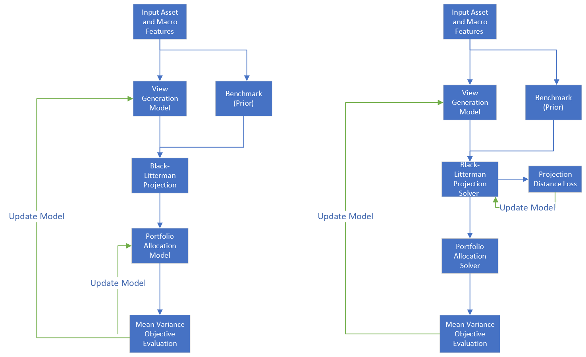

# Black-Litterman End-To-End

*Jetlir Duraj, Chenyu Yu*


## 1. Bayesian approach and the original Black-Litterman model

The original Black-Litterman model is a well-known technique for portfolio construction. It gives a seamless method to introduce investor views about the evolution of assets' returns and project these into a market benchmark that is used to estimate expected market returns and correlations of returns.

A recent survey [Kolm et al](https://www.pm-research.com/content/iijpormgmt/47/5/91) describes a Bayesian approach for the classical Black-Litterman (BL) model in detail. 

BL uses a parametric model to describe the distribution of asset returns $`p(r \mid \theta)`$. The traditional approach assumes that this distribution is normal, i.e. 
```math
\textrm{returns}\sim\mathcal N(\mu(\theta), \Sigma(\theta)),
```
where the $`\mu`$ and $`\Sigma`$ are the mean and covariance of the distribution. The prior, or sometimes referred to as benchmark, distribution $`\pi(\theta)`$ is the distribution of mean return in the absence of any investor views. 
```math
\mu(\theta) \sim \mathcal N (\mu_b, C_b).
```
$`(\mu_b, \Sigma_b)`$ is the mean and covariance of the benchmark portfolio return. And $`C_b`$ is investor's confidence in benchmark. Typically, $'C_b'$ is modeled as a scaling of an estimate of the covariance matrix, e.g. the usual sample covariance estimator, e.g. the investor can choose $`C_b = \tau_b \Sigma_b`$ scaled by $`\tau_b > 0`$, where $`\Sigma_b`$ is the sample covariance. 

Now, suppose the investor has some views about the market. These views can always be phrased as $`P \mu(\theta) = q`$, which is to say that the expected return of a certain portfolio $`P ` \in \mathbb R^{V\times n}$ (V is the number of views and n is the number of assets being traded) of assets will be $`q`$. And the investor can attach certain confidence to their view by letting $`P \mu(\theta) `$ be a random vector:
```math
P \mu(\theta) \sim \mathcal N(q, \Omega),
```
where $`\Omega`$ is the view confidence matrix. In the traditional model the views are also normal distributed.

Then one can update the prior with the views using Bayes rules to obtain a posterior distribution $`r\mid  q \sim \mathcal N(\mu_{BL}, \Sigma_{BL})`$.
```math
\mu_{BL-Bayes} = (P' \Omega^{-1} P' + C_b^{-1})^{-1}( P'\Omega^{-1} q + \mu_b),\quad
\Sigma_{BL-Bayes} = ( P'\Omega^{-1}P+C_b^{-1})^{-1}.
```
The investor can use this estimated return distribution to optimize their utility function over possible portfolio weights. For example, they can optimize a mean-variance criterion incorporating trading aversion:
```math
(\text{Bayes BL update})\quad\quad \max_{w} w' \mu_{BL} - \frac{\gamma^{ra}}{2} w' \hat{\Sigma}_{BL} w -\gamma^{tr}\|w-w_{-1}\|_1,
```
where $`\gamma^{ra} > 0,\, \gamma^{tr}>0`$ are the risk aversion and trade aversion parameters.


## 2. Black-Litterman end-to-end model

Our work is inspired by the Bayesian BL approach. We propose the BLEnd2End model, in which in lieu of subjective investor views we use profitable trading strategies as views. We generate the predictions for the views about the market using machine learning methods from appropriate features.  Furthermore, to mitigate the compounding error inherent in traditional models which independently forecast mean return and allocate portfolios, we employ an end-to-end architecture that aims to solve both steps (estimation of views/returns+portfolio architecture) jointly. That is,  investor views $`(P, q)`$ and the portfolio weights are jointly optimized based on the mean-variance criterion above. Our BLEnd2End model has four distinct parts mirroring the traditional model.

### 1. Benchmark

For our application below, we use a factor model based on rolling Principal Component Analysis (PCA) to produce the benchmark $`(\mu_b, \Sigma_b)`$. 

### 1. Objective views are market-wide strategies learned through machine learning
We generate views based on observed features `x` appropriate for the asset universe. 
```math
{q} = \texttt{ViewNet}(x)
```
The confidence $`\Omega`$ of view modeling is the view portfolio covariance scaled by $`\tau_v`$. This choice is justified since our views are objectively generated.

### 2. BL-update
One caveat of the Bayes BL-update is the assumption that $`\Sigma_b`$ is always invertible. However, this is not always the case in a high-dimensional dataset. Hence there are two ways to perform BL-update:

- **Bayesian update**: whenever possible, directly update use closed form solution (Bayes BL update).

- **Distance solver**: project views onto benchmark space by minimizing probability distribution distance $`Dist(\cdot \mid \cdot)`$:
```math
(\mu_{BL}, \Sigma_{BL}) = \underset{P \mu = q}{\arg\min}\,D((\mu, \Sigma) \mid (\mu_b, \Sigma_b)).
```
In our work, the probability distance measure can be chosen from the Wasserstein-2 distance,  Jensen-Shannon Divergence, and Kullback-Leibler divergence. Equations for these distance measures can be found in the paper. 
Our implementation incorporates the constraint that the views are satisfied through a Lagrangian penalty, with a *large* Lagrangian parameter:

```math
(\mu_{BL}, \Sigma_{BL}) = \arg\min_{(\mu,B,d)}D\left((\mu,B\cdot B' + Diag(d\circ d))\mid(\mu_b,\Sigma_b)\right)+\lambda\lVert P\mu-\hat q\rVert^2,
```
where $`\lambda`$ is a large number that penalizes violation of the views.

### 3. Portfolio Allocation

For a batch $`\mathcal B`$ with potentially multiple dates present, and expected returns and covariance estimates $`(\hat\mu_{t}, \hat\Sigma_{t})`$, the training criterion can be one of the two. First choice we try is *Batch-data-loss*, which is directly optimizing the mean-variance criterion:

```math
(\textrm{Batch-data-loss})\quad\quad\ell_b (w ; \hat\mu_{t}, \hat\Sigma_{t}) = \sum_{t \in \mathcal B} w_t^T \hat\mu_{t} - \frac{\gamma^{ra}}{2} w^T \hat\Sigma_{t} w - \gamma^{tr} \|w_t - w_{t-1}\|_1
```
Second, we try *FOC-loss*, which reduces the input dimension by using the first-order condition (detailed derivation see full paper) of the mean-variance criterion:
```math
(\textrm{FOC-loss})\quad\quad \ell_{foc}(\Delta; \hat\mu_t, \hat\Sigma_t) = \sum_{t\in \mathcal{B}}\lVert (\gamma^{ra}\hat\Sigma_t)\Delta_t+\gamma^{tr}sign(\Delta_t) -\left(\hat\mu_t-\hat\Sigma_t w_{-1}\right) \rVert^2.
```
Note that this second choice is viable, because the objective function is convex. 
We allow for the portfolio allocation to be solved in two ways.
1. Portfolio allocation is modeled by an FFN:
```math
w = \texttt{FFN}(\mu_{BL}, {\Sigma}_{BL},w_{-1}).
```
This is part of the **joint optimization approach**: there is a single model that is trained for both view generation and portfolio allocation. Technically, there is a global Adam optimizer that updates the weights of **both** $`\texttt{Viewnet}`$ and of the $`\texttt{FFN}`$ modeling the weights at the same time. 

2. The weights are optimized using a solver that we model with Pytorch and Adam optimizer. Here, the solver takes as parameters the same ones as in the joint approach $`(\mu_{BL}, {\Sigma}_{BL},w_{-1})`$,
```math
w = \texttt{WeightSolver}(\mu_{BL}, {\Sigma}_{BL},w_{-1}).
```
But there is no global Adam optimizer optimizing both a weights model and the view generation at the same time. This the **disjoint optimization approach**.

The following image is an illustration of BLEnd2End for both approaches. On the left is the joint optimization version, and on the right is the disjoint optimization version.



In the disjoint optimization approach, there is a trainable model that covers view generation, whereas the portfolio weights are solved through a solver. Moreover, we allow for the BL update to be solved using the **distance solvers** above. In the joint optimization approach there is a single model being trained that covers **both** view generation and portfolio allocation. 


## 3. Dataset for empirical implementation
Our asset universe contains 14 ETFs: BIL, IEF, SHY, TLT, SPY, XLB, XLE, XLF, XLI, XLK, XLP, XLU, XLV, XLY. downloaded from [WRDS TAQ database](https://wrds-www.wharton.upenn.edu/pages/get-data/nyse-trade-and-quote/). Our input features  `x` for the $`\texttt{ViewNet}`$ are macroeconomic time-series from [FRED](https://fred.stlouisfed.org/). 

The time horizon of this study is from 2008-02 to 2021-01-01 and it uses monthly data, where the test phase the last 30% of dates and the training-validation phase is the first 70% of dates. And validation takes up 30% of dates in the training-validation phase. For more details about the data, refer to our full paper.

### 3.1 Benchmark model for BL

We use rolling PCA predictive regressions with various number of factors, where factors are extracted from the covariance matrix.

## 4. Machine learning implementation details
This section contains details about the architecture and hyperparameter space we search over in the training of the BLEnd2End architecture.

### Data splitting
The test phase constitutes the last 30% of dates, whereas the training and validation phase is the first 70% of dates. Validation takes up 30% of dates in the training-validation phase, or equivalently 21% of the overall dates.

### Hyperparameter and architecture space

We train a total of 6,912 models based on the combination of different neural network architectures and hyperparameters that are described below.

- **Number of PCA factors for the benchmark** are selected out of [3, 5].
- **Optimizer**: We use the Adam optimizer for the global optimization, as well as for `BLSolver` case and the `WeightSolver` case. We always fix the momentum parameter of Adam at 0.9.
- **Batch sizes for the global optimizer** are selected out of [28, 56, 112].
- **Learning rate of the global optimizer** comes from [0.001, 0.0001].
- **Global training criterion** is based on the mean-variance objective with trading costs.
- **L1-regularization of the global training criterion** is selected from [0, 0.01, 0.1].
- **L2-regularization for the global training criterion (weight decay in the Adam optimizer)** is also selected from [0, 0.01, 0.1].
- **Number of epochs for global training** is 40 epochs for the whole end-to-end system.
- **Validation phase criterion and early stopping**: We use Sharpe ratio to evaluate the performance in the global optimization in each epoch. As an additional regularization procedure, we use early stopping if the Sharpe ratio has not improved after 8 consecutive epochs.
- **ViewNet** is selected from either of the following 4 neural network definitions:
    - FFN with hidden units of [64, 32, 16] or [64, 64, 32, 32, 16, 16] (note: 2 possible choices here), using SiLU (sigmoid linear unit) as activation function. The dropout rate is 0.05 and we also use batch normalization.
    - RNN in the form of GRUs (Gated Recurrent Units) with either 4 or 8 hidden states (note: 2 possible choices here). The sequence length of features fed to the GRU is 6 months and it has one layer. The dropout rate is again 0.05.
- **BL-updater** is selected from one of the following 4 possibilities:
    - BLEnd2End-Bayesian with view confidence scaler $`\tau_v`$ = 1/7.
    - BLEnd2End-Solver: We use Adam optimizer with 40 iterations and learning rate 0.0001.
- **Portfolio allocation** is determined by choosing one out of the 4 following possibilities:
    - WeightNet: this is for the **joint** optimization case.
    - WeightDiffNet: this is for the **joint** optimization case.
    - WeightSolver uses Adam as an optimizer with a learning rate of 0.0001 and 40 iterations to either maximize the mean-variance criterion, or to minimize the loss based on the first-order-condition (note: these are 2 possible choices).
- **Leverage constraint**: The portfolio weights from any of the above portfolio calculation models are normalized with a bound of 0.5 on $`L^2`$-norm. This leads to an effective leverage upper bound of 1.87. This is a soft bound, i.e. the system chooses the leverage at the date level endogenously, as long as it is below the upper bound. See paper for details.
- **Choice criterion for the best model and ensemble procedure**: We choose the best model architecture and hyperparameters using the last registered Sharpe ratio in the validation phase. The best model and architecture are then retrained with 5 additional distinct seeds to the seed used for the training. We ensemble the 6 thus obtained models and evaluate final performance based on the return time series on the test set.

## 5. Results on ETF dataset

#### Train, validation and test portfolio performance

We evaluate portfolios based on following metrics: Sharpe, Sortino, Calmar ratios, maximum drawdown (MDD). All values below are monthly values.

*BLEnd2End* portfolio performance through train, validation and test phase.

|       | mean return (%) | vol (%) | sharpe | sortino  | calmar | mdd   |
| ----- | ----------------------- | --------------- | ------ | -------- | ------ | ----- |
| train | 2.378                   | 3.116           | 0.769  | 8909.853 | 4.930  | 0.005 |
| val   | 0.458                   | 1.057           | 0.441  | 53.306   | 0.145  | 0.032 |
| test  | 0.256                   | 0.971           | 0.266  | 38.685   | 0.109  | 0.023 |

*Benchmark* portfolio performance through train, validation and test phase:

|       | mean return (%) | vol (%) | sharpe | sortino | calmar | mdd   |
| ----- | ----------------------- | --------------- | ------ | ------- | ------ | ----- |
| train | 0.399                   | 4.800           | 0.084  | 0.709   | 0.013  | 0.314 |
| val   | -0.296                  | 2.022           | -0.149 | -4.393  | -0.022 | 0.135 |
| test  | 0.321                   | 2.619           | 0.124  | 2.147   | 0.023  | 0.137 |

#### Test phase BLEnd2End and benchmark portfolio comparison
BLEnd2End achieves a much higher risk-adjusted return than the no-BL-update mean-variance portfolio benchmark.
|                    |   sharpe |   sortino |   calmar |   mdd |   mean leverage |
|--------------------|----------|-----------|----------|-------|-----------------|
| BLEnd2End          |    0.266 |    38.685 |    0.109 | 0.023 |           0.653 |
| 5-Factor Benchmark |    0.124 |     2.147 |    0.023 | 0.137 |           1.383 |

#### Test phase BLEnd2End and other ETF strategies comparison

The BLEnd2End portfolio demonstrates great ability in drawdown control by achieving monthly Sortino ratio of 38.685, outperforming all the other common ETF strategies like risk parity, 60%-stocks-40%-bonds fix-mix and equal weights portfolio. 

|               | sharpe | sortino | calmar | mdd   |
| ------------- | ------ | ------- | ------ | ----- |
| BLEnd2End     | 0.266  | 38.685  | 0.109  | 0.023 |
| Risk Parity   | -0.028 | -3.620  | -0.003 | 0.035 |
| 60-40         | 0.087  | 2.005   | 0.011  | 0.155 |
| Equal Weights | 0.076  | 1.687   | 0.010  | 0.147 |

#### Test phase sector-only BLEnd2End and other ETF strategies comparison

The sector only BLEnd2End sub-strategy performs better than sector momentum rotation and reversal with much smaller MDD and higher Sharpe, Sortino and Calmar ratio. Note that here BLEnd2End weights on the sectors is not re-scaled.

|                          | sharpe | sortino | calmar | mdd   |
| ------------------------ | ------ | ------- | ------ | ----- |
| BLEnd2End Sectors        | 0.248  | 39.345  | 0.078  | 0.028 |
| Sector Momentum Rotation | 0.063  | 1.034   | 0.009  | 0.207 |
| Sector Momentum Reversal | 0.106  | 1.611   | 0.018  | 0.171 |
